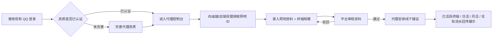

# 手助网吧代理结算管理平台 · 产品需求文档

> **v3 单角色评审版** · 2026-06-08
> 本文档对齐当前 `billing-platform/` Demo：**取消网吧主角色、取消网吧主分成，所有网吧录入与管理动作均由代理执行**。

---

## 📌 一页速览

| 维度 | 当前结论 |
| --- | --- |
| 业务角色 | **仅保留「代理」一种业务角色**；平台管理端为内部视角 |
| 主链路 | QQ 登录 → 完善资质 → 录入网吧 → 平台审核 → 代理铺设 → 数据展示 |
| 网吧 ID | 由代理向迪越 / 区域经理获取，**不是平台审核后分配** |
| 终端口径 | 终端规模（人工维护）≠ 已活跃终端（数据回传） |
| 流水口径 | **只展示实际 / 已结算流水**，不展示「本月预估」 |
| 平台端 | 总览 / 网吧明细 / 审核记录 三 Tab，是代理看板的上级视角 |

---

## 📑 文档信息

| 项目 | 内容 |
| --- | --- |
| 文档版本 | v3.0 |
| 文档状态 | 评审中 |
| 文档日期 | 2026-06-08 |
| 作者 | 产品（董子霄） |
| 评审对象 | 研发 / 测试 / 设计 / 运营审核员 |
| Demo 版本 | v3 单角色版（代理端 + 平台管理端） |

### 修订记录

| 版本 | 日期 | 修改人 | 修改内容 |
| --- | --- | --- | --- |
| v1.0 | 2026-06-04 | 董子霄 | 首版：代理 / 网吧主双角色 + 关联 / 解绑审批 |
| v3.0 | 2026-06-08 | 董子霄 | 转单角色：取消网吧主与分成；补 QQ 登录后资质完善、网吧 ID、终端规模、历史实际流水、平台管理端总览 / 代理看板 / 网吧明细 / 审核记录 |

---

## 1. 背景与目标

### 1.1 背景

手助网吧加盟体系由 **应用宝手助 × 迪越** 联合运营，目标是让代理把全国网吧通过「霸服俱乐部」终端接入手助分发与会员体系。

上一版 Demo 拆出「代理 + 网吧主」双角色，并设计了关联、网吧主审批、解绑、网吧主收益等流程。本轮评审决定不再引入网吧主线上角色：

1. **代理是实际执行人**：网吧 ID 获取、资料录入、铺设跟进、后续维护都由代理负责。
2. **网吧主不参与平台分成**：当前阶段无需建模网吧主收益、提现、分成。
3. **关联审批链路过重**：双向绑定 / 解绑审批不符合当前演示目标。
4. **管理端需要上级视角**：不仅审核资料，还要看到代理 / 网吧 / 终端 / 活跃 / 流水的全局看板。

### 1.2 产品目标

| 目标 | 度量口径 | Demo 验收标准 |
| --- | --- | --- |
| 简化入驻链路 | 只保留代理一种业务角色 | 不再出现网吧主登录、网吧主控制台、网吧主分成 |
| 支持代理录入网吧 | 代理可直接录入网吧 ID、资料、终端规模 | 录入后生成待审核记录，平台可审核 |
| 支持代理管理网吧 | 代理可查看 / 编辑 / 删除 / 模拟铺设 / 看流水 | 网吧管理页可完成全部动作 |
| 展示真实运营口径 | 终端规模、已活跃终端、日活、月活、实际流水 | 不展示「本月预估」 |
| 支持平台上级管理 | 总览 + 代理看板 + 网吧明细 + 审核记录 | `/admin/audit` 具备 3 个管理 Tab |

### 1.3 不在范围

- 网吧主账号 / 登录 / 控制台
- 代理 ↔ 网吧主关联、审批、解绑
- 散店、网吧主直连结算、网吧主分成、网吧主提现
- 合同签署 / 模板 / 审核
- 真实 QQ 互联 SDK、真实结算接口
- 多代理组织架构、区域经理后台、细分权限后台

---

## 2. 角色与权限

### 2.1 当前角色

| 角色 | 入口 | 说明 |
| --- | --- | --- |
| **代理** | `/`、`/register`、`/agent/*` | 唯一业务操作角色，负责录入和维护网吧 |
| **平台管理端用户** | `/admin/audit` | 迪越 / 手助内部审核与经营管理视角 |

### 2.2 权限矩阵

| 能力 | 代理 | 平台管理端 |
| :--- | :-: | :-: |
| 使用现有 QQ 登录 | ✅ | ❌ |
| 完善代理资质 | ✅ | ❌ |
| 录入网吧资料 | ✅ | ❌ |
| 编辑网吧名称 / 地址 / 联系人 / 电话 / 终端规模 | ✅（仅自己名下） | ❌（本期只读） |
| 删除网吧（二次确认） | ✅（仅自己名下） | ❌ |
| 审核网吧资料 | ❌ | ✅ |
| 查看代理端概览 | ✅（仅自己） | ✅（全局 + 代理维度） |
| 查看网吧明细 | ✅（仅自己名下） | ✅（全平台） |
| 查看历史实际流水 | ✅（仅自己名下） | ✅（全平台） |

### 2.3 已下线能力

- 网吧主角色 / 资料完善 / 登录入口
- 代理发起关联、网吧主审批关联
- 双向解绑审批、申请池
- 散店 / 已关联代理状态
- 网吧主收益、提现、分成

---

## 3. 端到端主链路

### 3.1 主链路图



### 3.2 关键业务约束

> 这 6 条是 v3 评审重点，请研发务必内化。

1. **网吧 ID 不是平台分配的**：字段 `externalCafeId`，由代理提前向迪越 / 区域经理获取。
2. **平台审核仅审资料有效性**：`MCxxxx` 只是 Demo 内部系统记录 ID，不能被讲成「平台分配的业务网吧 ID」。
3. **终端规模由代理人工维护**：字段 `terminalScaleCount`，录入时填写，后续可编辑。
4. **已活跃终端来自数据回传**：字段 `terminalCount`，铺设前为 0，页面显示「待铺设」**而不是 0**。
5. **日活 / 月活率分母 = 终端规模**：`dailyActiveTerminal / terminalScaleCount`、`monthlyActiveTerminal / terminalScaleCount`。
6. **流水只展示实际值**：不展示「本月预估」；历史流水弹窗只展示已结算月份。

### 3.3 端到端步骤

| 步骤 | 角色 | 动作 | 系统副作用 | 页面 |
| :-: | --- | --- | --- | --- |
| A | 代理 | QQ 扫码 / 密码登录 | 密码登录 Demo 直接模拟「资质已认证」 | `/` |
| B | 代理 | 完善资质（如未认证） | 写 `AccountProfile`，`authStatus='verified'` | `/` 资质 Tab 或 `/register` |
| C | 代理 | 线下向迪越 / 区域经理获取网吧 ID | 平台只在表单里记录 | 线下 |
| D | 代理 | 录入网吧 ID / 名称 / 地区 / 地址 / 终端规模 / 联系人 / 电话 | 创建 `MyCafe`，`tempId=P-XXXX`，进入待审核 | `/agent/my-cafes` |
| E | 平台 | 审核资料：通过 / 驳回 | 通过 → `approved`；驳回 → 记录原因 | `/admin/audit` |
| F | 代理 | 线下铺设，Demo 点「模拟铺设」 | 写入 `launchedAt`、`terminalCount`、日活 / 月活、`monthRevenue` | `/agent/my-cafes` |
| G | 代理 / 平台 | 查看运营数据 | 聚合为代理概览、平台总览、网吧明细、历史流水 | `/agent/dashboard`、`/admin/audit` |

---

## 4. 用户故事

### 4.1 代理（Agent）

| ID | 故事 | 验收要点 |
| --- | --- | --- |
| US-A01 | 用现有 QQ 号登录 | 扫码 / 密码两 Tab；密码登录直接进已认证代理控制台 |
| US-A02 | 完善代理资质 | 表单含主体类型、企业执照 / 个人实名、联系人、手机、邮箱、地址、协议 |
| US-A03 | 联系客服 | 登录页与代理端全局可见联系客服入口 |
| US-A04 | 录入网吧资料 | 必填网吧 ID、名称、省市、地址、终端规模、联系人、电话 |
| US-A05 | 修正门店资料 | 网吧管理页支持编辑名称 / 地址 / 终端规模 / 联系人 / 电话 |
| US-A06 | 看每家网吧运营数据 | 表格展示终端规模、已活跃终端、日活、月活 / 月活率、实际流水、状态 |
| US-A07 | 查看历史流水 | 操作列「流水记录」，弹窗展示已结算月份明细 |
| US-A08 | 删除录错的网吧 | 必须输入门店全名才能删除，仅能删自己名下网吧 |

### 4.2 平台管理端

| ID | 故事 | 验收要点 |
| --- | --- | --- |
| US-P01 | 看全局经营总览 | 总览展示代理数 / 网吧数 / 终端规模 / 已活跃终端 / 实际流水 / 待审核单数 |
| US-P02 | 按代理维度看数据 | 代理数据看板展示网吧数、终端、活跃、流水、待审核 / 待铺设 |
| US-P03 | 看全平台网吧明细 | 列出每家网吧、归属代理、终端、活跃、流水、状态、联系人 |
| US-P04 | 处理网吧资料审核 | 待审核 / 已审核 Tab，支持通过 / 驳回 + 备注 |

---

## 5. 页面级详细需求

### 5.1 `/` 登录页

#### 页面结构

| 区域 | 内容 |
| --- | --- |
| 左侧品牌区 | 霸服俱乐部品牌 + 数据卡片 |
| 右侧登录卡 | `扫码登录` / `密码登录` / `完善资质` 三 Tab |
| 底部小入口 | 注册账号 · 意见反馈 · **联系客服** · 平台管理端入口 |

#### 字段与交互

| 模块 | 字段 / 操作 | 规则 |
| --- | --- | --- |
| 扫码登录 | QQ 二维码 | Demo 自动流转 `waiting → scanned → confirmed`，确认后进代理控制台 |
| 密码登录 | QQ 号、密码 | 点击 `登录（模拟资质已认证）` 后 toast 成功并 `navigate('/agent/dashboard')` |
| 完善资质 | 主体类型 | 企业 / 个人 |
| 完善资质 | 企业执照 / 个人实名 | 企业上传执照 + 企业信息；个人实名校验口径 |
| 完善资质 | 联系人 / 手机 / 邮箱 / 省市 / 地址 | 必填 |
| 完善资质 | 协议勾选 | 必勾才能提交 |
| 小入口 | 联系客服 | 打开客服触达入口 |
| 小入口 | 平台管理端 | 跳转 `/admin/audit` |

#### 验收要点

- 不要求 QQ 号在平台「创建」，优先使用现有 QQ。
- 密码登录是最快演示路径，**点击后必须能进代理控制台，不能黑屏**。
- 「完善资质」Tab 用于演示「已登录但未完善」场景。

---

### 5.2 `/register` 代理资质完善页

> 单角色版本下，注册页只保留代理资质完善语义，**不再选择「网吧主」**。

| 步骤 | 字段 | 说明 |
| --- | --- | --- |
| 主体信息 | 主体类型 | 企业 / 个人 |
| 实名认证 | 企业：企业名 + 统一社会信用代码 + 营业执照<br>个人：实名信息 | 按主体类型切换 |
| 联系方式 | 联系人 / 手机 / 邮箱 / 省市 / 详细地址 | 业务联系信息 |
| 协议确认 | 短信通知 + 平台代理协议 | 勾选后可提交 |

提交成功后进入 `/agent/dashboard`，模拟 `authStatus='verified'`。

---

### 5.3 `/agent/dashboard` 代理概览首页

#### 页面结构

```text
┌──────────────────────────────────────────────────────────────┐
│ 1. 代理身份卡 / 联系客服入口 / 录入网吧按钮                   │
├──────────────────────────────────────────────────────────────┤
│ 2. 待办横幅：待审核 · 待铺设                                  │
├──────────────────────────────────────────────────────────────┤
│ 3. 指标卡：网吧数 / 已上线 / 终端规模 / 已活跃终端 …          │
├──────────────────────────────────────────────────────────────┤
│ 4. 终端活跃率 / 流水概览                                      │
└──────────────────────────────────────────────────────────────┘
```

#### 本次改动

- ❌ 去除右上角「代理信息」按钮
- ❌ 去除「最近动态」模块
- ✅ 待审核提示文案改为「资料审核通过后可安排铺设」（不再出现「平台分配网吧 ID」）
- ✅ 区分「终端规模」与「已活跃终端」两个口径

#### 指标口径

| 指标 | 公式 / 数据源 |
| --- | --- |
| 录入网吧数 | `summary.cafeCount` |
| 已上线网吧数 | `summary.launchedCafeCount` |
| 待审核数 | `summary.pendingAuditCount` |
| 待铺设数 | `summary.pendingLaunchCount` |
| 终端规模 | `Σ terminalScaleCount` |
| 已活跃终端 | `Σ terminalCount` |
| 日活终端 | `Σ dailyActiveTerminal` |
| 月活终端 | `Σ monthlyActiveTerminal` |
| 实际流水 | `Σ monthRevenue`，仅展示实际值 |

---

### 5.4 `/agent/my-cafes` 网吧管理（核心页）

#### 5.4.1 顶部能力

| 能力 | 说明 |
| --- | --- |
| 录入网吧 | 代理新增网吧资料，提交后进入待审核 |
| 统计卡 | 网吧数 / 终端规模 / 已活跃终端 / 实际流水 |
| 待铺设提示 | 审核通过但未铺设的网吧可点「模拟铺设」 |

#### 5.4.2 录入网吧弹窗

| 字段 | 必填 | 校验 / 说明 |
| --- | :-: | --- |
| 网吧 ID | ✅ | 代理从迪越 / 区域经理获取；不知道时联系区域经理 |
| 网吧名称 | ✅ | 建议带分店名以区分同名门店 |
| 所在地区 | ✅ | 省 / 市级联 |
| 详细地址 | ✅ | 需具体到门牌号或楼层 |
| 终端规模数 | ✅ | 代理人工填写，可后续编辑 |
| 现场联系人 | ✅ | 店长 / 门店负责人 |
| 联系电话 | ✅ | 手机号格式 |

提交后：生成临时编号 `P-XXXX`，状态 `platformAuditStatus='pending'`，提示「已提交资料，等待平台审核」。

#### 5.4.3 表格字段

| 列名 | 字段 | 渲染规则 |
| --- | --- | --- |
| 网吧 ID | `externalCafeId` | 业务网吧 ID（代理录入） |
| 系统 ID / 临时编号 | `id` / `tempId` | 审核前展示 `tempId`，审核后展示 `MCxxxx` |
| 网吧名称 | `name` | 同时展示审核 / 铺设状态 Tag |
| 省 / 市 / 地址 | `province` / `city` / `address` | 长文本截断 |
| 终端规模 | `terminalScaleCount` | 代理人工维护 |
| 已活跃终端 | `terminalCount` | 未铺设显示「待铺设」 |
| 日活终端 | `dailyActiveTerminal` | 未铺设显示 `-` |
| 月活 / 月活率 | `monthlyActiveTerminal / terminalScaleCount` | 以终端规模为分母 |
| 实际流水 | `monthRevenue` | 只展示实际值 |
| 状态 | `platformAuditStatus` + `launchedAt` | 待审核 / 已驳回 / 待铺设 / 已上线 |
| 联系人 | `contact` / `phone` | 可编辑 |
| 操作 | — | 编辑 · 流水记录 · 模拟铺设 · 删除 |

#### 5.4.4 操作

| 操作 | 触发条件 | 行为 |
| --- | --- | --- |
| 编辑 | 自己名下网吧 | 修改名称 / 地址 / 终端规模 / 联系人 / 电话 |
| 流水记录 | 已铺设上线 | 弹窗展示历史已结算流水 |
| 模拟铺设 | 审核通过且未铺设 | 写入 `launchedAt` + 已活跃终端 / 日活 / 月活 / 实际流水 |
| 删除 | 自己名下网吧 | 红色确认弹窗，必须输入门店全名才能删除 |

#### 5.4.5 历史流水弹窗

| 字段 | 说明 |
| --- | --- |
| 月份 | 已结算月份，例 `2026-05` |
| 实际流水 | 当月已结算实际流水 |
| 已活跃终端 | 当月已活跃终端 |
| 日活终端 | 当月日活 |
| 月活终端 | 当月月活 |
| 状态 | 已结算 |

> 严格不出现「本月预估」「预计收入」等口径。

---

### 5.5 `/agent/profile` 代理信息

| 区块 | 字段 | 说明 |
| --- | --- | --- |
| 基本信息 | 代理 ID / 角色 / 入驻日期 / 实名状态 | 只读 |
| 实名信息 | 主体类型 / 真实姓名 / 身份证脱敏 / 企业名 / 信用代码 | 只读 |
| 联系方式 | 联系人 / 手机 / 邮箱 / 省市 / 详细地址 | 只读 |

> 本次改动：移除「代理名下网吧」模块，避免与网吧管理页重复。

---

### 5.6 `/admin/audit` 平台管理端

> 名称从「平台审核台」升级为「平台管理端」。它是代理端数据看板的上级视角：**代理端 = 平台端按单个代理过滤后的子集**。

#### Tab 结构

```text
┌─ Tab 1：总览 ─────────────────────────────────────────────┐
│  全局指标卡 + 代理数据看板                                 │
├─ Tab 2：网吧明细 ─────────────────────────────────────────┤
│  全平台网吧列表：网吧是谁、归属代理是谁、数据如何           │
├─ Tab 3：审核记录 ─────────────────────────────────────────┤
│  待审核 / 已审核记录，通过 / 驳回操作                       │
└──────────────────────────────────────────────────────────┘
```

#### 5.6.1 总览 Tab

| 指标 | 口径 |
| --- | --- |
| 代理数 | 当前平台下代理数量 |
| 网吧数 | 全平台网吧总数 |
| 终端规模 | `Σ terminalScaleCount` |
| 已活跃终端 | `Σ terminalCount` |
| 实际流水 | `Σ monthRevenue` |
| 待审核单数 | `platformAuditStatus='pending'` 数量 |

代理数据看板字段：

| 字段 | 说明 |
| --- | --- |
| 代理 ID / 名称 / 省份 | 代理基础信息 |
| 网吧数 / 已上线 / 待审核 / 待铺设 | 代理名下门店状态 |
| 终端规模 / 已活跃终端 / 日活 / 月活 | 代理维度运营数据 |
| 实际流水 | 代理名下网吧实际流水汇总 |

#### 5.6.2 网吧明细 Tab

| 列 | 说明 |
| --- | --- |
| 网吧 ID | `externalCafeId` |
| 系统 ID / 临时编号 | `id` / `tempId` |
| 网吧名称 / 地址 | 门店基础信息 |
| 归属代理 | `agentName` / `agentId` |
| 终端规模 | 代理维护规模 |
| 已活跃终端 | 数据回传终端 |
| 日活 / 月活 | 运营活跃 |
| 实际流水 | 真实展示值 |
| 状态 | 待审核 / 已驳回 / 待铺设 / 已上线 |
| 联系人 | 门店联系人 + 电话 |

#### 5.6.3 审核记录 Tab

| 子区块 | 数据源 | 操作 |
| --- | --- | --- |
| 待审核 | `getPendingPlatformReviews()` | 通过 / 驳回 |
| 已审核 | `getPlatformReviewHistory()` | 只读：审核结果 / 时间 / 备注 |

| 操作 | 行为 |
| --- | --- |
| 通过 | 可填备注；状态置 `approved`；提示「资料审核完成，代理可安排铺设上线」 |
| 驳回 | **必填原因**；状态置 `rejected`；后续支持代理修改重提 |

---

## 6. 数据模型与 Mock API

### 6.1 `MyCafe`

```ts
type MyCafe = {
  id: string;                         // 系统内部记录 ID（Demo 中为 MCxxxx）
  tempId?: string;                    // 审核前临时编号 P-XXXX
  externalCafeId: string;             // 代理录入的业务网吧 ID
  name: string;
  province: string;
  city: string;
  address: string;
  terminalScaleCount: number;         // 代理人工维护的终端规模
  terminalCount: number;              // 已活跃终端数
  monthlyActiveTerminal: number;
  dailyActiveTerminal: number;
  monthRevenue: number;               // 实际流水展示值
  contact: string;
  phone: string;
  status: 'pending' | 'normal';
  platformAuditStatus: 'pending' | 'approved' | 'rejected';
  platformAuditRemark?: string;
  platformAuditAt?: string;
  createdAt: string;
  launchedAt?: string;
  declaredTerminalCount: number;
  agentId: string;
  agentName: string;
};
```

### 6.2 `AccountProfile`

```ts
type AccountProfile = {
  roleId: string;
  role: 'agent';
  subjectType: 'personal' | 'company';
  realName: string;
  idCard: string;
  companyName?: string;
  creditCode?: string;
  contact: string;
  phone: string;
  email: string;
  province: string;
  city: string;
  address: string;
  authStatus: 'verified' | 'pending';
  registeredAt: string;
};
```

### 6.3 关键 Mock 函数

| 函数 | 用途 |
| --- | --- |
| `addMyCafe(input)` | 代理录入网吧，生成待审核记录 |
| `reviewCafeApprove(tempId, remark?)` | 平台审核通过 |
| `reviewCafeReject(tempId, remark)` | 平台审核驳回 |
| `getPendingPlatformReviews()` | 平台待审核列表 |
| `getPlatformReviewHistory()` | 平台已审核记录 |
| `getPlatformCafes()` | 平台全量网吧明细 |
| `getPlatformAgentOverview()` | 平台代理数据看板 |
| `setCafeLaunched(cafeId)` | Demo 模拟铺设上线并生成运营数据 |
| `updateCafeInfo(cafeIdOrTempId, agentId, patch)` | 代理编辑网吧资料 |
| `getCafeRevenueHistory(cafe)` | 获取历史已结算流水 |
| `deleteCafe(cafeIdOrTempId, agentId)` | 代理删除自己名下网吧 |
| `summarizeCafes(cafes)` | 统计网吧 / 终端 / 活跃 / 流水 |

### 6.4 v3 真实接口预留

| 接口 | 方法 | 说明 |
| --- | --- | --- |
| `/api/auth/qq/login` | POST | QQ 号密码登录 |
| `/api/auth/qq/qrcode` | POST/GET | 扫码登录初始化与轮询 |
| `/api/agent/profile` | GET/POST | 查询 / 提交代理资质 |
| `/api/cafes` | GET | 查询代理名下或平台全量网吧 |
| `/api/cafes` | POST | 代理录入网吧 |
| `/api/cafes/:id` | PATCH | 代理编辑网吧资料 |
| `/api/cafes/:id` | DELETE | 代理删除网吧 |
| `/api/cafes/:id/launch` | POST | 铺设上线回调 |
| `/api/cafes/:id/revenue-history` | GET | 历史实际流水 |
| `/api/admin/overview` | GET | 平台总览 |
| `/api/admin/agents/overview` | GET | 代理数据看板 |
| `/api/admin/reviews` | GET | 待审核 / 已审核记录 |
| `/api/admin/reviews/:tempId/approve` | POST | 审核通过 |
| `/api/admin/reviews/:tempId/reject` | POST | 审核驳回 |

---

## 7. 异常与边界

| 编号 | 场景 | 处理 |
| --- | --- | --- |
| EX-01 | 代理不知道网吧 ID | 录入弹窗提示「请联系区域经理获取」 |
| EX-02 | 网吧 ID 为空 | 表单阻断提交 |
| EX-03 | 终端规模为空或 < 1 | 表单阻断提交 |
| EX-04 | 平台驳回未填原因 | 弹窗 required，按钮置灰 |
| EX-05 | 审核前展示终端 / 流水 | 显示「待审核」或 `-`，**不显示 0** |
| EX-06 | 审核通过但未铺设 | 显示「待铺设」，可点模拟铺设 |
| EX-07 | 未铺设点击流水记录 | 提示暂无流水或入口置灰 |
| EX-08 | 删除门店输入名称不一致 | 删除按钮置灰 |
| EX-09 | 代理编辑非自己名下网吧 | 后端返回 `not_yours`，前端 toast 提示无权限 |
| EX-10 | 密码登录后黑屏 | 路由 / 图标 import / Dashboard 依赖完整；登录成功必须能进 `/agent/dashboard` |

---

## 8. 非功能需求

| 类别 | 要求 |
| --- | --- |
| 性能 | Demo ≤ 100 条无需虚拟滚动；真实系统 500+ 启用虚拟列表 / 分页 |
| 安全 | QQ 登录态、代理 ID、网吧归属由后端校验，前端不可作为权限来源 |
| 隐私 | 手机 / 身份证 / 邮箱默认脱敏；本期不做导出 |
| 可用性 | 平台审核 SLA ≤ 1 工作日；驳回原因可追溯 |
| 兼容 | PC Web，Chrome / Edge 现代版本优先 |
| 审计 | 录入 / 编辑 / 删除 / 审核 / 铺设 / 流水回传均记录操作人与时间 |

### 8.1 关键埋点

| 事件 ID | 触发位置 | 必传字段 |
| --- | --- | --- |
| `qq_login_success` | QQ 登录成功 | `loginType`、`agentId`、`authStatus` |
| `agent_profile_submit` | 完善资质提交 | `subjectType`、`province`、`city` |
| `cafe_submit` | 代理录入网吧 | `tempId`、`externalCafeId`、`agentId`、`terminalScaleCount`、`province` |
| `cafe_edit` | 编辑网吧资料 | `cafeId`、`agentId`、`changedFields` |
| `cafe_audit_pass` / `cafe_audit_reject` | 平台审核 | `tempId`、`cafeId`、`auditorId`、`remark` |
| `cafe_launched` | 铺设上线 | `cafeId`、`agentId`、`terminalScaleCount`、`terminalCount` |
| `cafe_revenue_history_view` | 查看历史流水 | `cafeId`、`agentId` |
| `cafe_deleted` | 删除网吧 | `cafeId`、`externalCafeId`、`agentId` |
| `admin_overview_view` | 平台总览 | `auditorId` |

---

## 9. 风险与待澄清

| ID | 风险 / 问题 | 影响 | 建议 |
| --- | --- | --- | --- |
| R-01 | 网吧 ID 来源仍线下，缺系统校验 | 录入错误 ID | 接迪越网吧 ID 校验接口；`externalCafeId` 做唯一约束 |
| R-02 | 终端规模为人工维护字段 | 与实际铺设不一致 | 保留编辑日志；后续接资产 / 终端系统校验 |
| R-03 | 实际流水未接真实结算 | Demo 与财务口径有差 | 真实系统需定义 T+N、退款、冲正、结算状态 |
| R-04 | 平台管理端目前单代理 Mock | 多代理聚合需真实组织数据 | 后续补代理列表、区域、归属、权限范围 |
| R-05 | 驳回后重新提交机制未完全建模 | 闭环不全 | 补「修改后重新提交」状态与接口 |
| R-06 | 联系客服仅 Demo 触达 | 无真实工单 | 后续接企微 / 工单系统 |

### 9.1 待澄清问题

1. 网吧 ID 的权威来源：迪越接口 vs 区域经理人工维护？
2. `externalCafeId` 是否允许跨代理重复提交？谁仲裁？
3. 终端规模变更是否需要平台审核，还是代理可直接生效？
4. 实际流水结算周期是 T+1、T+7 还是月结？
5. 平台管理端是否需要按区域 / 省份 / 代理筛选？
6. 客服入口后续接企微、电话、在线客服还是工单？

---

## 10. 评审 checklist

- [ ] 当前阶段只保留代理单角色
- [ ] 不再展示网吧主登录、网吧主审批、网吧主分成
- [ ] QQ 密码登录可直接模拟资质已认证并进入代理端
- [ ] 登录页保留「完善资质」演示 Tab
- [ ] 代理录入网吧必须填写业务网吧 ID
- [ ] 「网吧 ID」不是平台审核后分配
- [ ] 终端规模与已活跃终端是两个字段
- [ ] 日活 / 月活率以终端规模为分母
- [ ] 只展示实际流水与历史已结算流水，不展示本月预估
- [ ] 代理端概览去除「代理信息」按钮和「最近动态」模块
- [ ] 网吧管理支持编辑和历史流水记录
- [ ] 代理信息页移除「代理名下网吧」模块
- [ ] 平台管理端含总览 / 网吧明细 / 审核记录
- [ ] 平台管理端能看代理维度、网吧归属、终端、活跃、流水

---

## 附录 A：版本关系

| 目录 | 说明 |
| --- | --- |
| `billing-platform/` | 当前 v3 单角色版本，本文档描述对象 |
| `billing-platform-v2/` | 上一版双角色快照（代理 / 网吧主 / 关联审批） |
| `billing-platform-v1/` | 更早期原型快照 |

## 附录 B：术语表

| 术语 | 定义 |
| --- | --- |
| 代理 | 当前唯一业务角色，负责录入网吧、维护资料、安排铺设、看数据 |
| 平台管理端 | 迪越 / 手助内部管理视角：总览 + 代理看板 + 网吧明细 + 审核记录 |
| 网吧 ID | 代理从迪越 / 区域经理获取的业务 ID，字段 `externalCafeId` |
| 系统 ID | Demo 内部记录 ID（如 `MCxxxx`），**不是业务网吧 ID** |
| 临时编号 | 审核前记录编号，例 `P-XXXX` |
| 终端规模 | 代理人工维护的门店终端规模，字段 `terminalScaleCount` |
| 已活跃终端 | 铺设后由数据回传产生的活跃终端数，字段 `terminalCount` |
| 实际流水 | 已产生 / 已结算的流水展示值，不含预估 |
| 待审核 | 已提交资料，平台尚未通过 / 驳回 |
| 待铺设 | 资料审核已通过，但代理尚未完成线下铺设 |

---

> 📍 **本文件位置**：`billing-platform/docs/PRD-加盟管理平台_可读版.md`
> 📍 **完整版同步**：`billing-platform/docs/PRD-加盟管理平台.md`
> 📍 **版本快照**：`billing-platform/docs/PRD-加盟管理平台_v3.0.md`
