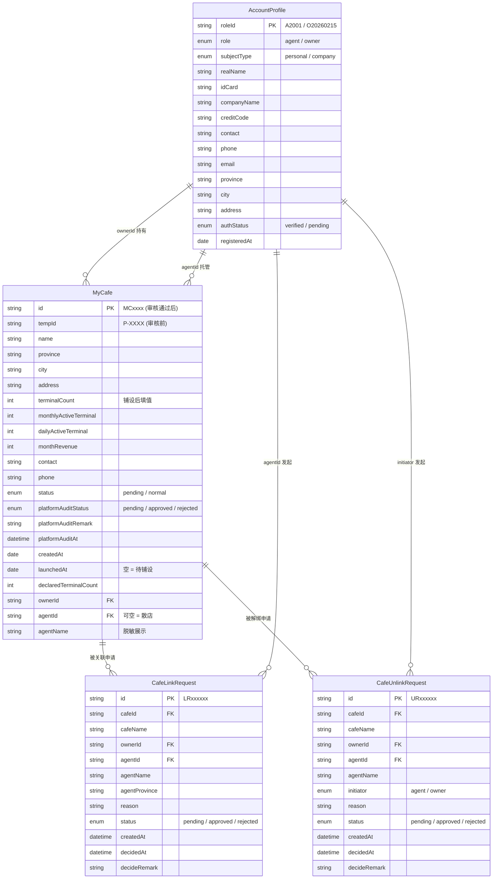
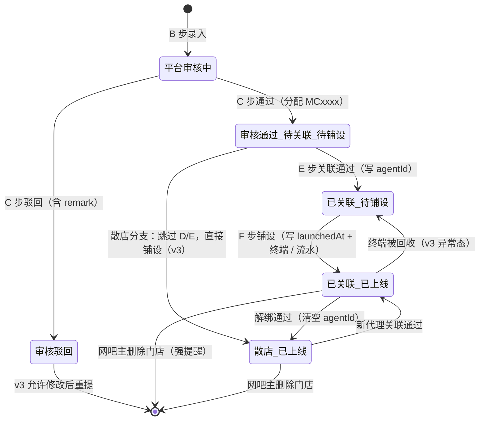
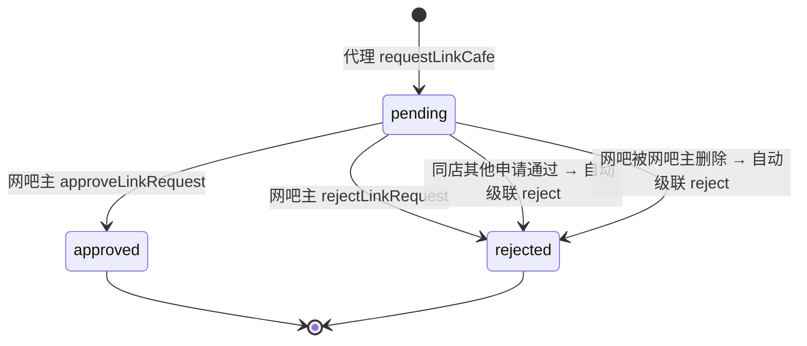
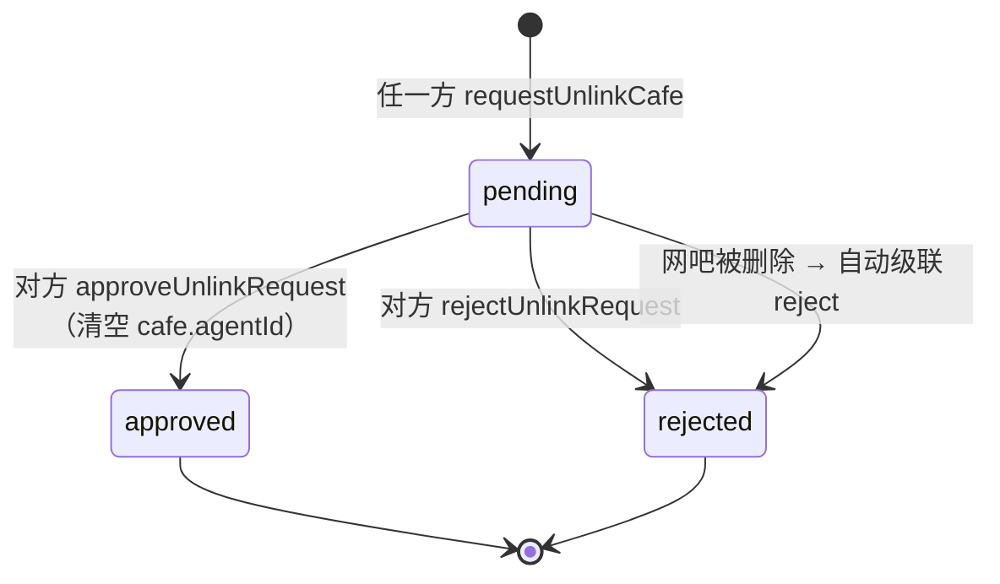

# 接口与数据模型（研发对齐文档）

> 这是 PRD 的研发侧补充。PRD 描述「业务规则 + 用户交互」，本文档描述「数据形状 + API 契约 + 状态机」。
>
> 配合阅读：`docs/PRD-加盟管理平台.md`、`src/mock/data.ts`（Demo 数据真源）。

| 项目 | 内容 |
| --- | --- |
| 文档版本 | v1.0 |
| 文档日期 | 2026-06-04 |
| 与 PRD 对齐 | v1.0 |
| 数据真源（Demo） | `src/mock/data.ts` |

---

## 1. ER 图



### 1.1 关系约束（DDL 级）

| 约束 | 说明 |
| --- | --- |
| `MyCafe.ownerId` NOT NULL | 网吧必须归属某网吧主 |
| `MyCafe.agentId` NULL = 散店 | 不强制关联代理 |
| `MyCafe.id` 仅在 `platformAuditStatus='approved'` 后生成 | 用 `tempId` 占位避免空值 |
| `MyCafe(ownerId, name)` 唯一 | 防同一网吧主下重名（v3 强制） |
| `CafeLinkRequest(cafeId, agentId, status='pending')` 唯一 | 防同代理对同店重复申请 |
| `CafeUnlinkRequest(cafeId, status='pending')` 唯一 | 防同店并发解绑 |

---

## 2. 三大状态机

### 2.1 MyCafe 状态机



| 状态名 | `status` | `platformAuditStatus` | `agentId` | `launchedAt` |
| --- | --- | --- | --- | --- |
| 平台审核中 | `pending` | `pending` | — | — |
| 审核驳回 | `pending` | `rejected` | — | — |
| 审核通过 / 待关联 / 待铺设 | `normal` | `approved` | NULL | NULL |
| 已关联 / 待铺设 | `normal` | `approved` | 有值 | NULL |
| 已关联 / 已上线 | `normal` | `approved` | 有值 | 有值 |
| 散店 / 已上线 | `normal` | `approved` | NULL | 有值 |

### 2.2 CafeLinkRequest 状态机



### 2.3 CafeUnlinkRequest 状态机



---

## 3. API 契约（v3 后端落地用）

> Demo 用同步 mock 函数；本节是 v3 立项时 RESTful 接口的预设契约。命名风格：资源名复数 + 子资源动词。

### 3.1 认证 / 注册

| 接口 | Method | URL | 入参 | 返回 |
| --- | --- | --- | --- | --- |
| QQ 扫码初始化 | POST | `/api/qq/qrcode/init` | — | `{ token, qrcodeImage }` |
| QQ 扫码状态查询 | GET | `/api/qq/qrcode/status?token=xxx` | — | `{ status: 'waiting'\|'scanned'\|'confirmed'\|'expired', userInfo? }` |
| QQ 号密码登录 | POST | `/api/qq/login` | `{ qq, password }` | `{ token, userInfo }` |
| 人脸校验初始化 | POST | `/api/auth/face/init` | — | `{ token, qrcodeImage }` |
| 人脸校验结果 | GET | `/api/auth/face/result?token=xxx` | — | `{ status, realName?, idCard? }` |
| 短信验证码 | POST | `/api/sms/send` | `{ phone }` | `{ ok }` |
| 邮箱验证码 | POST | `/api/email/send` | `{ email }` | `{ ok }` |
| 提交注册 | POST | `/api/account/register` | `RegisterPayload` | `{ roleId, role, ...AccountProfile }` |
| 当前账户 | GET | `/api/account/me` | — | `AccountProfile` |
| 修改联系方式 | PUT | `/api/account/contact` | `{ phone?, email?, address?, code }` | `AccountProfile` |

`RegisterPayload`：

```ts
{
  role: 'agent' | 'owner';
  subject: 'personal' | 'company';
  // personal
  realName?: string; idCard?: string;
  // company
  companyName?: string; creditCode?: string; licenseUrl?: string;
  // common
  contact: string;
  phone: string; phoneCode: string;
  email: string; emailCode: string;
  province: string; city: string; address: string;
  agreeSms: true; agreeProtocol: true;
}
```

### 3.2 网吧（MyCafe）

| 接口 | Method | URL | 入参 | 返回 |
| --- | --- | --- | --- | --- |
| 列表（按角色过滤） | GET | `/api/cafes` | query: `ownerId?` / `agentId?` / `status?` / `platformAuditStatus?` | `MyCafe[]` |
| 全平台按 ID 查（仅 approved） | GET | `/api/cafes/:id` | path | `MyCafe`（404 = 不存在或未审核） |
| 录入（B 步） | POST | `/api/cafes` | `CafePayload` | `MyCafe`（含 tempId） |
| 平台审核-通过（C 步） | POST | `/api/cafes/:tempId/audit/approve` | `{ remark? }` | `{ ok, cafeId }` |
| 平台审核-驳回（C 步） | POST | `/api/cafes/:tempId/audit/reject` | `{ remark }` required | `{ ok }` |
| 待审核列表 | GET | `/api/cafes/audit/pending` | — | `MyCafe[]` |
| 审核历史 | GET | `/api/cafes/audit/history` | query: `from?` / `to?` | `MyCafe[]` |
| 铺设上线（F 步） | POST | `/api/cafes/:id/launched` | — | `MyCafe`（含 launchedAt + 终端 / 流水） |
| 删除（网吧主） | DELETE | `/api/cafes/:id` | header: `X-Owner-Id` 校验 + body `{ confirmName }` 必须等于 `cafe.name` | `{ ok }` |

`CafePayload`：

```ts
{
  name: string;
  province: string; city: string; address: string;
  declaredTerminalCount: number;  // 1-500
  contact: string; phone: string;
  // ownerId 由网关从 token 注入，不接收前端传值
}
```

### 3.3 关联申请（CafeLinkRequest）

| 接口 | Method | URL | 入参 | 返回 |
| --- | --- | --- | --- | --- |
| 发起关联（D 步） | POST | `/api/cafes/:id/link-request` | `{ reason }`（agentId 由 token 注入） | `CafeLinkRequest`（或 `409` + reason） |
| 审批通过（E 步） | POST | `/api/link-requests/:reqId/approve` | `{ remark? }` | `{ ok, cafe: MyCafe }` |
| 审批驳回 | POST | `/api/link-requests/:reqId/reject` | `{ remark }` required | `{ ok }` |
| 列表（owner 待审批） | GET | `/api/link-requests/inbox` | — | `CafeLinkRequest[]` |
| 列表（agent 我发的） | GET | `/api/link-requests/outbox` | query: `status?` | `CafeLinkRequest[]` |

**409 错误码与 `reason` 映射**（PRD 5.4.2 已贴前端文案）：

| HTTP code | `reason` | 含义 |
| --- | --- | --- |
| 404 | `cafe_not_found` | 网吧 ID 不存在 |
| 409 | `cafe_not_approved` | 网吧未通过平台审核 |
| 409 | `already_linked_self` | 已是自家托管网吧 |
| 409 | `already_linked_other` | 已被其他代理关联 |
| 409 | `duplicate_pending` | 已存在 pending 申请 |

### 3.4 解绑申请（CafeUnlinkRequest）

| 接口 | Method | URL | 入参 | 返回 |
| --- | --- | --- | --- | --- |
| 发起解绑 | POST | `/api/cafes/:id/unlink-request` | `{ initiator, reason }`（initiator 由 token 角色推断） | `CafeUnlinkRequest`（或 `409`） |
| 审批通过 | POST | `/api/unlink-requests/:reqId/approve` | `{ remark? }` | `{ ok, cafe }` |
| 审批驳回 | POST | `/api/unlink-requests/:reqId/reject` | `{ remark }` required | `{ ok }` |
| 收件箱（按角色） | GET | `/api/unlink-requests/inbox` | — | `CafeUnlinkRequest[]`（自动按当前角色过滤 initiator） |
| 我发起的 | GET | `/api/unlink-requests/outbox` | — | `CafeUnlinkRequest[]` |

### 3.5 聚合 / 统计

| 接口 | Method | URL | 入参 | 返回 |
| --- | --- | --- | --- | --- |
| Dashboard 聚合 | GET | `/api/dashboard/summary` | — | `CafeScaleSummary`（同 `summarizeCafes`） |

`CafeScaleSummary`：

```ts
{
  cafeCount: number;
  terminalCount: number;
  monthlyActiveTerminal: number;
  dailyActiveTerminal: number;
  monthRevenue: number;
  linkedAgentCafeCount: number;
  standaloneCafeCount: number;
}
```

---

## 4. Demo Mock 函数 ↔ v3 接口对照表

> 帮研发把 Demo 调用快速翻译成真实 API。

| Demo 函数（`src/mock/data.ts`） | 行号 | v3 接口 |
| --- | --- | --- |
| `getCafesByOwner(ownerId)` | 259 | `GET /api/cafes?ownerId=...` |
| `getCafesByAgent(agentId)` | 256 | `GET /api/cafes?agentId=...` |
| `findCafeById(id)` | 262 | `GET /api/cafes/:id`（内部 / owner 视角） |
| `findApprovedCafeById(id)` | 266 | `GET /api/cafes/:id`（agent 视角，仅 approved 可见） |
| `getPendingLaunchCafesForAgent(agentId)` | 270 | `GET /api/cafes?agentId=...&launched=false` |
| `addMyCafe(input)` | 316 | `POST /api/cafes` |
| `reviewCafeApprove(tempId, remark?)` | 352 | `POST /api/cafes/:tempId/audit/approve` |
| `reviewCafeReject(tempId, remark)` | 365 | `POST /api/cafes/:tempId/audit/reject` |
| `getPendingPlatformReviews()` | 375 | `GET /api/cafes/audit/pending` |
| `getPlatformReviewHistory()` | 378 | `GET /api/cafes/audit/history` |
| `setCafeLaunched(cafeId)` | 384 | `POST /api/cafes/:id/launched` |
| `deleteCafe(cafeId, ownerId)` | 400 | `DELETE /api/cafes/:id` |
| `requestLinkCafe(input)` | 429 | `POST /api/cafes/:id/link-request` |
| `approveLinkRequest(reqId, remark?)` | 455 | `POST /api/link-requests/:reqId/approve` |
| `rejectLinkRequest(reqId, remark)` | 478 | `POST /api/link-requests/:reqId/reject` |
| `getLinkRequestsForOwner(ownerId)` | 275 | `GET /api/link-requests/inbox` |
| `getLinkRequestsByAgent(agentId)` | 280 | `GET /api/link-requests/outbox` |
| `requestUnlinkCafe(input)` | 492 | `POST /api/cafes/:id/unlink-request` |
| `approveUnlinkRequest(reqId, remark?)` | 523 | `POST /api/unlink-requests/:reqId/approve` |
| `rejectUnlinkRequest(reqId, remark)` | 538 | `POST /api/unlink-requests/:reqId/reject` |
| `getUnlinkRequestsForOwner(ownerId)` | 286 | `GET /api/unlink-requests/inbox`（角色=owner） |
| `getUnlinkRequestsForAgent(agentId)` | 292 | `GET /api/unlink-requests/inbox`（角色=agent） |
| `getPendingUnlinkForCafe(cafeId)` | 304 | `GET /api/cafes/:id/unlink-request?status=pending` |
| `summarizeCafes(cafes)` | 558 | `GET /api/dashboard/summary` |
| `getMyProfile()` | 631 | `GET /api/account/me` |

---

## 5. 数据生成规则（关键算法）

### 5.1 临时编号 `tempId`

```
P-{随机 4 位 [A-Z0-9]}{自增序号 2 位}
例：P-A8F201 / P-7B3C02
```

### 5.2 正式 ID `MCxxxx`

```
MC + 自增序号 4 位补零
当前 demo: _cafeSeq=10，下一次审核通过分配 MC0011
```

### 5.3 申请 ID

| 类型 | 规则 | 例 |
| --- | --- | --- |
| 关联申请 `CafeLinkRequest.id` | `LR` + 6 位补零 | `LR000002` |
| 解绑申请 `CafeUnlinkRequest.id` | `UR` + 6 位补零 | `UR000001` |

### 5.4 铺设上线随机生成（F 步）

```ts
// 实际终端数 = 申报终端数 × [0.95, 1.05) 随机
terminalCount         = round(declared * (0.95 + random() * 0.10))
monthlyActiveTerminal = round(terminalCount * (0.85 + random() * 0.10))   // 85-95% 月活率
dailyActiveTerminal   = round(terminalCount * (0.60 + random() * 0.15))   // 60-75% 日活率
monthRevenue          = terminalCount * (260 + round(random() * 80))      // 单台 ¥260-340 / 月
```

> v3 接霸服系统后，这四个值由硬件 ack 真实回传，不再随机生成。

### 5.5 姓名脱敏（`maskName`）

```ts
// 1 字 → 原样；> 1 字 → 首字母 + 其余打 *
maskName('李建国') === '李**'
maskName('王')     === '王'
```

### 5.6 散店判定

```ts
isStandalone(cafe) === !cafe.agentId
```

不再按账号判定（v1 旧口径），改为按网吧粒度判定，便于同网吧主下混合状态。

---

## 6. 前端状态管理建议（v3）

| 维度 | 建议 |
| --- | --- |
| 远端数据 | 用 React Query / SWR；Key 按 `['cafes', { ownerId, agentId }]` 划分；写后 `invalidateQueries` |
| 当前角色 | 从 token 解出，写入全局 Context；不要再像 Demo 那样依赖 `sessionStorage` |
| Modal 状态 | 单个页面内部 useState；跨页（如注册引导弹 Modal）用 URL query（`?from=register`） |
| 表格分页 | 100 条以内不分页；500+ 启用 antd `<Table virtual />` |
| 防重复提交 | 关键提交（关联 / 解绑 / 删除）按钮加 loading + disabled，等接口返回 |
| 乐观更新 | 仅审批操作（approve / reject）做乐观更新；录入 / 关联请求不做（需要后端返回 ID） |

---

## 7. 测试用例骨架（给 QA）

> 完整 case 由 QA 在 TAPD 拆，这里给主链路冒烟用例骨架。

### 7.1 主链路冒烟（必过）

| Case ID | 场景 | 步骤 | 预期 |
| --- | --- | --- | --- |
| TC-MAIN-01 | A→G 全链路跑通 | 1) 网吧主注册 2) 录入网吧 3) 审核员通过 4) 代理注册 5) 代理按 ID 查询关联 6) 网吧主审批通过 7) 代理点铺设 8) 进 Dashboard 看数据 | 8 步全部成功，Dashboard 显示终端数 / 月活 / 流水非 0 |
| TC-MAIN-02 | 双向解绑（agent 发起） | 已建立关联后，代理点「申请解绑」→ 网吧主审批通过 | `cafe.agentId` 清空 |
| TC-MAIN-03 | 双向解绑（owner 发起） | 同上反向 | 同上 |
| TC-MAIN-04 | 删除门店级联 | 网吧主对一家有 pending 关联申请的网吧执行删除 | 该网吧消失 + 该 pending 申请变 rejected |

### 7.2 边界 case（必过）

| Case ID | 场景 | 预期 |
| --- | --- | --- |
| TC-EDGE-01 | 代理输入未审核网吧的 ID | 红字「该 ID 不存在或尚未通过平台审核」 |
| TC-EDGE-02 | 代理重复对同店发关联 | toast「申请审批中，请勿重复提交」 |
| TC-EDGE-03 | 网吧主审批关联通过时同店有其他 pending | 其他 pending 自动变 rejected，备注「该网吧已选择其它代理」 |
| TC-EDGE-04 | 同店并发解绑 | 第二个发起者按钮置灰 |
| TC-EDGE-05 | 删除门店时输入名称错误 | 确认按钮置灰 |
| TC-EDGE-06 | 审核员驳回未填原因 | 弹窗确认按钮置灰 |
| TC-EDGE-07 | 铺设前进 Dashboard | 终端 / 流水显示「⏳ 待铺设」，不显示 0 |

### 7.3 兼容性（抽测）

| Case ID | 场景 |
| --- | --- |
| TC-COMP-01 | Chrome 100+ / Edge 100+ / Safari 15+ 各跑一遍主链路 |
| TC-COMP-02 | 屏幕宽度 1280 / 1440 / 1920 各检查一次布局不破 |

---

## 8. 演进路线图（给 PM 自己看）

| 版本 | 主要交付 | 时间窗 |
| --- | --- | --- |
| **v2.3（当前 Demo）** | 角色注册 + 关联 + 数据展示 + QQ 登录 + 平台审核台 | 已交付 |
| v2.4 | 散店 / 已关联代理两种结算口径的 UI 区分（不接真实分润） | 评审后 1 周 |
| v3.0 | 接真实后端：QQ 互联 SDK + 人脸校验 + 短信 / 邮箱 + 落库 | 评审后 1 个月 |
| v3.1 | 接霸服硬件 ack（替换 F 步 mock） | v3.0 上线后 2 周 |
| v4.0 | 结算引擎 + 合同 + 提现（PRD 增量章节） | 评审后 2 个月 |
| v4.1 | 迪越运营后台（代理管理 / 全局看板 / 风控审计） | v4.0 后 1 个月 |
